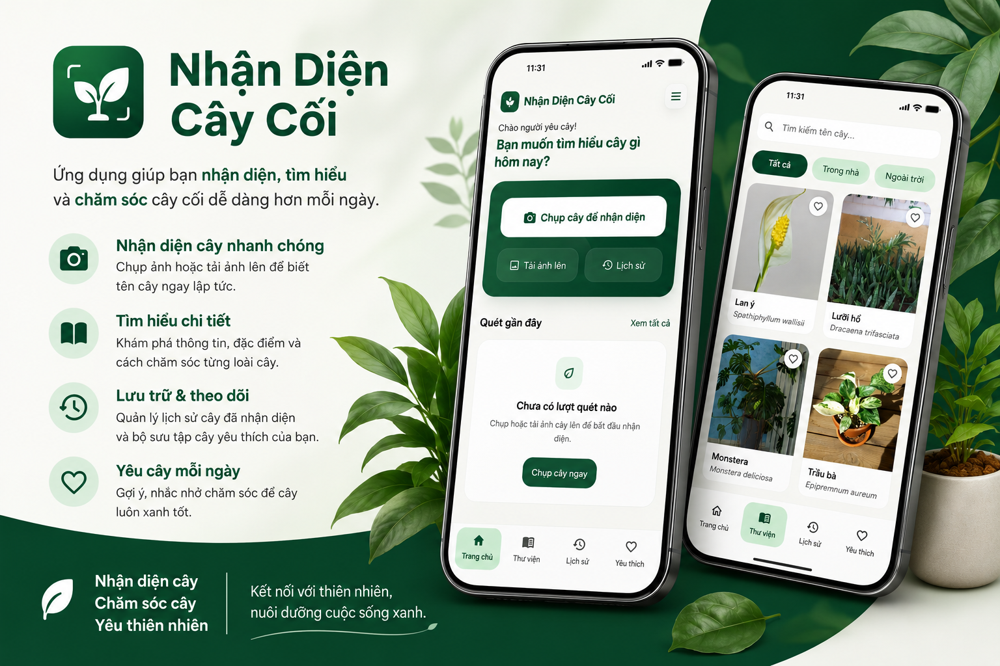
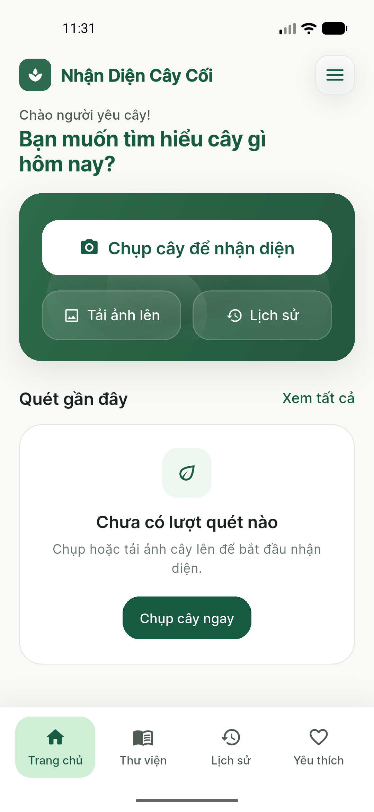
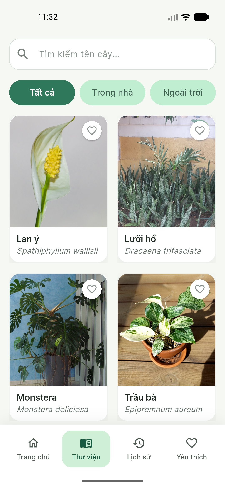

# Plant Recognition App

A Flutter application that recognizes plants from camera photos or uploaded images, stores scan history locally, lets users favorite plants, browse a plant library, and syncs user data through Supabase.

<p align="center">
  
  
  
  
</p>

<p align="center">
  
</p>

## Overview

This project follows a local-first approach:

- Core data is stored in `SQLite` so the app stays fast and usable even with weak or unstable network
- `Supabase Auth` handles sign up, sign in, password updates, and user sessions
- `Supabase Database` is used to sync data across devices
- Plant recognition is powered by `Gemini`, either directly in development or through a `Supabase Edge Function` in release mode

## Demo

### Video Demo

Demo video: [Watch the demo](https://www.youtube.com/@xoandev)

### Screenshots

<table>
  <tr>
    <td align="center">
      
      <br />
      <sub><b>Home</b></sub>
    </td>
    <td align="center">
      
      <br />
      <sub><b>Library</b></sub>
    </td>
  </tr>
</table>

## Features

<table>
  <tr>
    <td width="50%" valign="top">
      <ul>
        <li>Capture photos with the camera</li>
        <li>Pick images from the gallery</li>
        <li>Recognize plants with AI</li>
        <li>View plant details with care guidance, growing conditions, and reference notes</li>
      </ul>
    </td>
    <td width="50%" valign="top">
      <ul>
        <li>Browse a plant library with search and filters</li>
        <li>View recognition history</li>
        <li>Mark plants as favorites</li>
        <li>Manage user profile and authentication</li>
      </ul>
    </td>
  </tr>
  <tr>
    <td width="50%" valign="top">
      <ul>
        <li>Sync data between <code>SQLite</code> and <code>Supabase</code></li>
        <li>Enforce a daily recognition limit</li>
        <li>Support light and dark themes</li>
      </ul>
    </td>
    <td width="50%" valign="top">
      <ul>
        <li>Local-first architecture for responsive UX</li>
        <li>Release-safe recognition flow through backend</li>
        <li>Reusable service and state layer</li>
      </ul>
    </td>
  </tr>
</table>

## Architecture

Main flow:

1. The user opens the app
2. `AppBootstrap` loads environment values and initializes services
3. `AuthGate` decides whether to show the auth screen or the main app
4. The user selects or captures an image
5. `RecognitionScreen` sends the image to the recognition layer
6. The recognition layer returns a plant result from Gemini or the backend
7. The app saves the result to `SQLite`
8. `SyncScope` and `SyncService` sync local changes to `Supabase`

### Main Layers

- `lib/bootstrap` - App startup and service initialization
- `lib/config` - Environment configuration
- `lib/models` - Data models
- `lib/services` - Auth, database, recognition, and sync logic
- `lib/state` - Shared app state
- `lib/theme` - Light and dark themes
- `lib/ui` - Screens and reusable widgets

## Tech Stack

- Flutter
- Dart
- Provider
- `sqflite`
- `path`
- `image_picker`
- `http`
- `path_provider`
- `url_launcher`
- `flutter_dotenv`
- `supabase_flutter`
- `camera`
- `google_fonts`
- `flutter_spinkit`
- `lottie`

## Environment Requirements

- Flutter SDK
- Dart SDK
- Android Studio or VS Code
- Supabase account
- Gemini API key
- Supabase CLI if you want to run or deploy the Edge Function locally

## Environment Setup

Create a `.env` file at the project root:

```env
SUPABASE_URL=
SUPABASE_PUBLISHABLE_KEY=
GEMINI_API_KEY=
RECOGNITION_API_BASE_URL=
```

### Variable Reference

| Variable | Description |
| --- | --- |
| `SUPABASE_URL` | Supabase project URL |
| `SUPABASE_PUBLISHABLE_KEY` | Supabase publishable key |
| `GEMINI_API_KEY` | Used for direct dev calls or backend secrets |
| `RECOGNITION_API_BASE_URL` | Base URL of the recognition backend |

### Example Values

```env
SUPABASE_URL=https://your-project-ref.supabase.co
SUPABASE_PUBLISHABLE_KEY=sb_publishable_xxxxxxxx
GEMINI_API_KEY=your_gemini_api_key
RECOGNITION_API_BASE_URL=https://your-project-ref.functions.supabase.co
```

Notes:

- `AppConfig` reads values from `.env` first
- If `.env` is not bundled into the app, the app falls back to `--dart-define`
- The app also accepts `SUPABASE_ANON_KEY` as an alternative to `SUPABASE_PUBLISHABLE_KEY`

## Installation

```bash
git clone <repo-url>
cd Plant-Recognition-App
flutter pub get
```

## Running the App

The app supports two recognition modes:

### 1. Direct Gemini Access for Development

Good for quick testing before setting up a backend.

`.env`:

```env
SUPABASE_URL=...
SUPABASE_PUBLISHABLE_KEY=...
GEMINI_API_KEY=your_gemini_key
RECOGNITION_API_BASE_URL=
```

Run the app:

```bash
flutter run --dart-define-from-file=.env -d <deviceId>
```

### 2. Local Backend Development

Useful when you want a setup that is closer to production.

`.env`:

```env
SUPABASE_URL=...
SUPABASE_PUBLISHABLE_KEY=...
GEMINI_API_KEY=
RECOGNITION_API_BASE_URL=http://127.0.0.1:54321/functions/v1
```

Start Supabase locally:

```bash
supabase start
supabase functions serve recognize --env-file supabase/functions/.env.local
```

Then run the app:

```bash
flutter run --dart-define-from-file=.env -d <deviceId>
```

## Backend Setup

### 1. Create Tables and RPC on Supabase

Run:

```text
supabase/sync_setup.sql
```

This script creates:

- `user_plants`
- `user_recognition_records`
- `user_recognition_daily_usage`
- RPC `consume_recognition_daily_quota(...)`

### 2. Install Supabase CLI

```bash
npm install -g supabase
```

### 3. Login and Link the Project

```bash
supabase login
supabase link --project-ref <project-ref>
```

### 4. Set Edge Function Secrets

```bash
supabase secrets set GEMINI_API_KEY=your_gemini_key
supabase secrets set SUPABASE_URL=your_supabase_url
supabase secrets set SUPABASE_ANON_KEY=your_supabase_publishable_key
supabase secrets set SUPABASE_SERVICE_ROLE_KEY=your_service_role_key
supabase secrets set DAILY_RECOGNITION_LIMIT=15
```

### 5. Deploy the Function

```bash
supabase functions deploy recognize
```

## Release Notes

In release builds, the app should not call Gemini directly from the client.

If `RECOGNITION_API_BASE_URL` is not configured, recognition will not work in release mode.

In short:

- Dev builds can use Gemini directly
- Production should go through `Supabase Edge Function`
- Gemini API keys should stay on the backend, not inside the release app

## Testing

```bash
flutter analyze
flutter test
```

## Run Locally

```bash
git clone <repo-url>
cd Plant-Recognition-App
flutter pub get
flutter run --dart-define-from-file=.env -d <deviceId>
```

If you are using a Supabase-backed recognition flow, make sure these are configured before running:

```env
SUPABASE_URL=...
SUPABASE_PUBLISHABLE_KEY=...
RECOGNITION_API_BASE_URL=...
```

## Project Structure

```text
lib/
  bootstrap/          App startup and service initialization
  config/             Environment configuration
  models/             Data models
  services/           Auth, database, recognition, sync
  state/              Shared app state
  theme/              Light and dark themes
  ui/
    screens/          Main screens
    widgets/          Reusable widgets

supabase/
  functions/
    recognize/        Plant recognition Edge Function
  sync_setup.sql      Database schema and quota setup
```

## Current Status

The app currently includes:

- Main UI
- Sign in, sign up, and password change
- Library, history, favorites, and profile screens
- Local storage using `SQLite`
- Background sync with `Supabase`
- A recognition backend scaffold

Still recommended before official release:

- Rename `applicationId` from `com.example...`
- Configure release signing
- Deploy the recognition backend
- Finish app icon, app name, and store listing
- Add a privacy policy if publishing to a store

## Author

Xoan Dev
